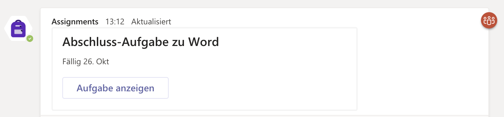
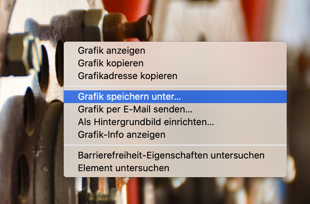

# 02\_B Word Abschlusstest

### Aufgabe

Formatiere gemäss [dieser Anleitung](https://kszich-my.sharepoint.com/:b:/g/personal/michael_liebich_kszi_ch/EZtr7j3GvSZOnUgRU6xP_IcB3p8eUrOc-rXp7aBYGEjsSQ?e=gbllrm) einen Rohtext. Am Schluss lädst Du das fertige Dokument in Teams hoch \(--&gt; Aufträge\).

### Wie die Anleitung verwendet wird:

Gehe die Anleitung Schritt für Schritt durch. Links sind orange umrahmt.

Öffnet sich beim Anklicken des Links ein Bild, so kannst du es mit einem Maus-Rechtsklick speichern und danach in dein Dokument einfügen.

