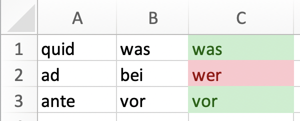
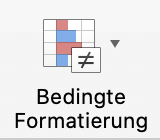
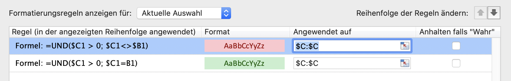

# 03\_C Excel Beispieldateien

## Wörter üben

Mit [dieser Excel-Datei](https://kszich-my.sharepoint.com/:x:/g/personal/michael_liebich_kszi_ch/ERVC24zCXtJKlHYPTJUCVGcBukkCXYMcDXEKZ0EH5i0mTg?e=yymEN4) kannst du Wörter üben 🎒 

In Spalte A stehen die lateinischen Wörter, in Spalte B die deutschen und in Spalte C kann man Wörter eingeben.

Stimmt das eingegebene Wort nicht mit dem Wort in Spalte B überein, so wird es rot gefärbt, sonst grün.

Wie geht das? Mit der sogenannten "bedingten Formatierung". Wähle die Spalte C durch Klicken auf "C" an. Klicke auf "Bedingte Formatierung"  und dann auf "Regeln verwalten". Jetzt siehst du diese 2 Formeln:

Die erste Formel prüft, ob die Wörter gleich sind und färbt das Wort in C1 grün falls dies der Fall ist.  
Die zweite Formel prüft, ob die Wörter unterschiedlich sind und färbt das Wort in C1 rot, falls dies der Fall ist.


Füge eigene Funktionen hinzu:  
1. Spalte C wählen  
2. Neue Regel wählen  
3. Formatvorlage Klassisch wählen  
4. Neue Formel zur... wählen


Viel Spass beim Üben! \(Nicht vergessen, die Spalte B zu verstecken 😜\)

