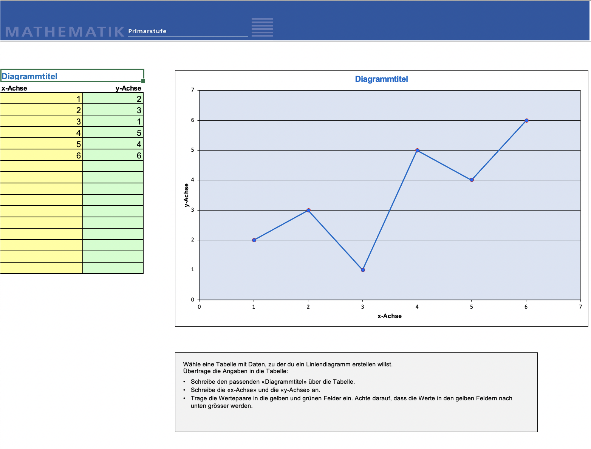
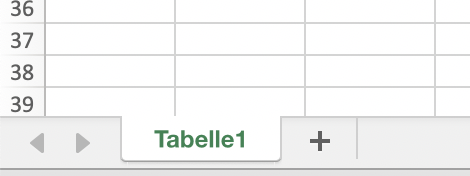
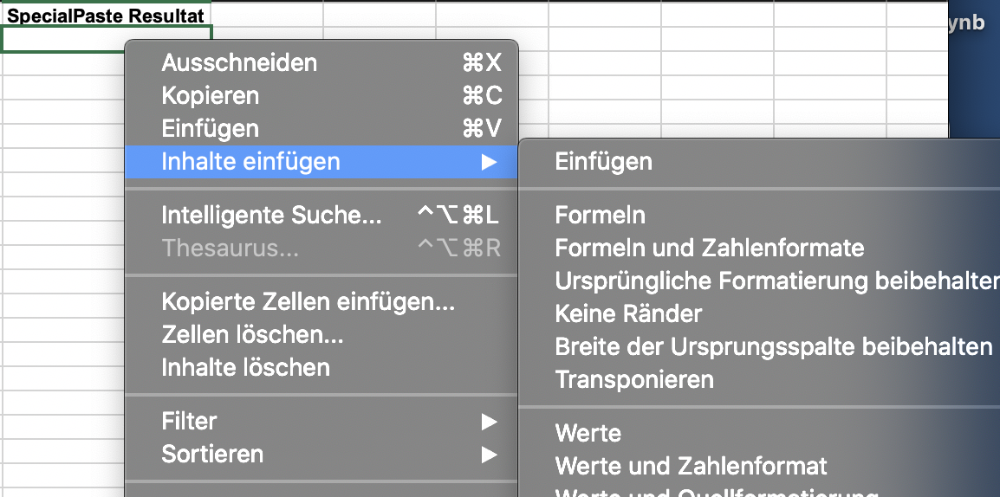
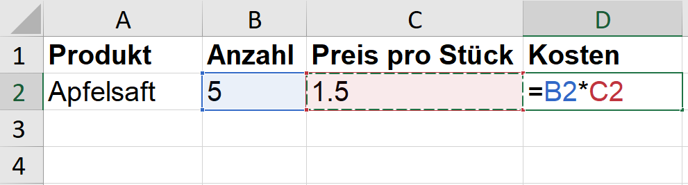
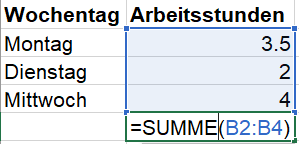
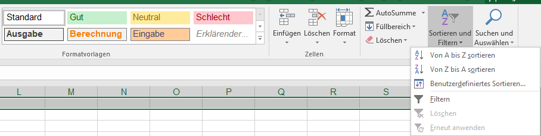
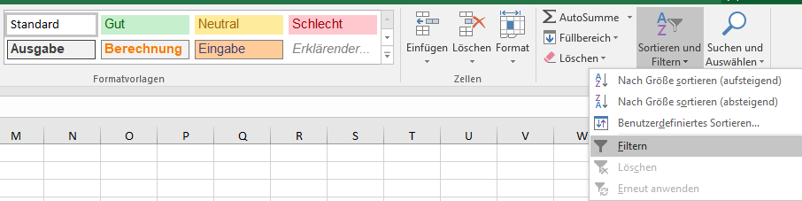
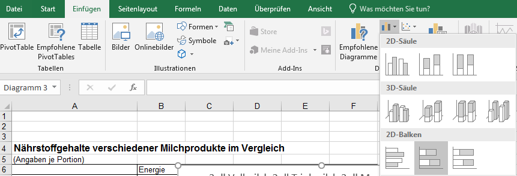
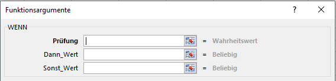
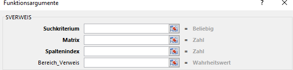

# 03\_A Excel

## 🎯 Lernziele

Ziel dieses Kurses ist es, in Excel Daten zu sortieren, zu filtrieren und sie in Diagrammen darzustellen. Du lernst, wie man mit den Daten in Excel rechnen kann und wie Du ein eigenes Notenberechnungsprogramm schreiben kannst. Als Abschluss des Kurses simulierst Du die Entwicklung einer Kaninchenpopulation.

## Vorbereitung

Melde dich zuallererst bei OneDrive an, indem du das OneDrive-Symbol im Dock anklickst.


In der Primarschule hast du bereits mit Excel gearbeitet und beispielsweise ein Diagramm beschriftet. In diesem Modul lernst du, selbst Tabellen einzurichten und mit Formeln zu arbeiten.


## Grundbegriffe

Excel ist eine Applikation um Daten auszuwerten, Daten zu visualisieren, Berechnungen durch- zuführen oder ganz einfach einen Datensatz nach einem bestimmten Kriterium zu sortieren.

Einige zentrale Begriffe, die du kennen solltest sind:

* Zeile: Horizontal angeordnete Reihe. Die Zeilenüberschriften werden durch Zahlen an- gegeben.
* Spalte: Vertikal angeordnete Reihe. Die Spaltenüberschriften werden durch Buchstaben angegeben
* Zelle: Schnittmenge zwischen Spalte und Zeile. Die Zellenbezeichnung ist daher zum Beispiel C5.
* Zellenbereiche: Ein Zellenbereich stellt repräsentiert mehrere Zellen, zum Beispiel B2:B5 \(Spalte B, Zeile 2,3,4,5\) oder C3:F3 \(Zeile 3, Spalte C, D, E, F\).

## Quicktipps

<table>
  <thead>
    <tr>
      <th style="text-align:left">Begriff</th>
      <th style="text-align:left">Definition</th>
    </tr>
  </thead>
  <tbody>
    <tr>
      <td style="text-align:left">Spaltenbreite anpassen</td>
      <td style="text-align:left">Um die Spaltenbreite so einzustellen, dass die Spalte gerade so breit
        wie der l&#xE4;ngste Eintrag in irgend einer Zelle dieser Spalte ist, gehst
        du mit dem Cursor in der Spaltenbeschriftung auf das rechte Zellenende
        und machst dort einen Doppelklick.</td>
    </tr>
    <tr>
      <td style="text-align:left">Anzahl Eintr&#xE4;ge</td>
      <td style="text-align:left">
        
W&#xE4;hlst du mehrere Zellen an, wird dir im rechten Fussbereich des

        
Excel-Fensters angegeben, wie viele Zellen angew&#xE4;hlt sind.

      </td>
    </tr>
  </tbody>
</table>

## Aufbau

Viele Funktionen des Menübands wie das Abspeichern der Datei, das Formatieren der Schrift etc. kennst du bereits aus dem ersten Teil \(Word\) und werden daher nicht noch einmal repetiert.

### Erstellen und organisieren von Arbeitsblättern

Beim Starten von Excel wird eine sogenannte Arbeitsmappe geöffnet. Jede neue Arbeitsmappe enthält drei Arbeitsblätter, die Seiten in einem Dokument ähneln. Daten werden also in Arbeitsblättern \(auch Tabellen genannt\) eingegeben. Jedes Arbeitsblatt trägt einen Namen. Unten links im Excel-Fenster siehst du die Arbeitsblätter als Register mit Namen: Tabelle1, Tabelle2 und Tabelle3. Wenn Du dir ein Arbeitsblatt anzeigen möchtest, klickst du auf das entsprechende Register.

Um ein neues Arbeitsblatt zu erstellen, klickst du auf das ”+” am Ende der aufgeführten Arbeitsblätter.


**Übung: Arbeitsmappen**

Lade die Datei [00\_arbeitsblaetter ](https://kszich-my.sharepoint.com/:x:/g/personal/michael_liebich_kszi_ch/ESC9dFS4K9BIje1YuM_STmYBTXxuzIS6h63MSJs6kTLe-g?e=6Ahzjr)herunter und bearbeite die dort aufgeführten Aufträge.


## Layout der Arbeitsblätter

Daten, egal welcher Art, sollten immer übersichtlich und ansprechend dargestellt werden. Der Leser sollte immer sofort die wesentlichen Datensätze erkennen können und nicht lange danach suchen müssen.

Zum Formatieren kannst du ähnlich wie bei Word die Schnellformatierungsoptionen verwenden.  

Mit dem Kessel-Symbol lassen sich Zellen und Zellbereiche einfärben. Die Höhe einer Zeile lässt sich einstellen, indem man mit der Maus auf die Zeilennummerierung am Zeilenbeginn geht. Wenn der Doppelpfeil erscheint, kann man von Hand anpassen. Alternativ kann ein Rechtsklick &gt; ”Zeilenhöhe” verwendet werden.


**Übung: Layout: Budget Fest**

Lade die Datei [fest.xlsx](https://kszich-my.sharepoint.com/:x:/g/personal/michael_liebich_kszi_ch/EaKTdBWp6TxKuQtHPrwwVPgBGgI7fyq9xRCuku-BZLCPKw?e=LDOSvx) herunter. Formatiere diese Datei, so dass sie am Ende wie [diese Datei](https://kszich-my.sharepoint.com/:b:/g/personal/michael_liebich_kszi_ch/Edwd_FI1szJAmLTLxrjyGBsBvy4OrIb6G5w3rmar0zwRsA?e=3J0dPb) ausschaut. Speichere dein Dokument, da du es später wieder brauchen wirst!


## Zellenformate

In Excel kann einzelnen Zellen oder ganzen Bereichen ein bestimmtes Format hinterlegt werden, so dass Excel klar ist, was für ein Datentyp \(Zeit, Datum, Währung, _. . ._\) in den Zellen hinterlegt ist.


**Übung: Zellenformate**

Lade die Datei [02\_formate](https://kszich-my.sharepoint.com/:x:/g/personal/michael_liebich_kszi_ch/ESQffNYGJKdHj19q35JaO1ABQLoq_Hk05Znn8VRAbIqtGg?e=JlwpHB) herunter und öffne sie.

1. In der ersten Zeile findest du das Datenformat, das du in den Zellen der zweiten Zeile hinterlegen sollst.
2. Rechtsklicke die Zelle A2 an und wähle "Zellen formatieren" aus.
3. Wenn du möchtest, kannst du die Formate noch genauer einstellen, indem du in der Gruppe Zahl das Menü öffnest.


## Grundfunktionen und einfache Rechnungen

### Zelleneinträge Kopieren und Einfügen

In Excel ist Copy/Paste nicht gleich Copy/Paste! Mit der nachfolgenden Übung wird dir gleich klar, was damit gemeint ist _. . ._


**Übung: Kopieren und Einfügen**

Lade die Datei [03\_grundkonzepte](https://kszich-my.sharepoint.com/:x:/g/personal/michael_liebich_kszi_ch/EToEnhzzTodGmQdngkgHYdQBTzuFCf6Ue62a46xkYdHssw?e=cNLM7O) herunter und öffne sie.

In den nachfolgenden zwei Beispielen geht es darum, Werte in Excel zu kopieren und in einer neuen Spalte einzufügen.

1. Selektiere alle Werte der Spalte ”Werte 1” und wähle auf der Tastatur **CMD + C**.
2. Gehe zur Zelle E2 und wähle auf der Tastatur **CMD + V**.
3. Vergleiche die Werte der beiden Spalten.
4. Selektiere nun die Werte der Spalte ”Resultat” und wähle auf der Tastatur CMD + C.
5. Gehe zur Zelle F2 und wähle auf der Tastatur CMD + V.
6. Vergleiche die Werte der beiden Spalten.

In der Spalte ”Resultate” sind nicht nur Werte sondern Funktionen hinterlegt. Mit Copy/Paste werden nicht die Werte sondern die Funktionen kopiert. In unserem Fall werden auch die Zellbezüge angepasst, wodurch andere Daten verwendet werden und somit andere Resultate erhalten werden.

Um lediglich die Werte ohne Funktion respektive Zellbezüge zu kopieren, musst du anders vorgehen.

1. Selektiere die Werte der Spalte ”Resultat” und wähle auf der Tastatur CMD + C.
2. Gehe zur Zelle G2 und mache einen Rechtsklick.
3. Wähle "Inhalte einfügen" &gt; Werte.
4. Lasse die Datei für die nächste Aufgabe offen.


### Zellen Einfügen


**Übung: Einzelne oder mehrere Zellen einfügen**

In der noch offenen Datei 03\_grundkonzepte fehlt in der Spalte A die ID 3. Ergänze die fehlende Zeile:

* Markiere die Zeile 4 und mache einen Rechtsklick.
* Wähle "einfügen".
* Tipp: schneller geht es mit der Tastenkombination **CMD + Shift + ”+”**.

In der Spalte A fehlen auch die Einträge 11 - 14. Die fehlenden Zeilen sollen ergänzt werden.

* Markiere die Zeile mit der ID 15 und die vier nachfolgenden Zeilen \(es sollen ja vier Zeilen einfügen\) und mache einen Rechtsklick.
* Wähle "einfügen".
* Tipp: schneller geht es mit der Tastenkombination CMD + Shift + ”+”.


### Produkt

Stell dir vor, du möchtest einen Event planen und herausfinden, wie viel dieser in etwa kosten wird. Nehmen wir an, dass du eine Spalte mit einzukaufenden Produkten hast, eine Spalte mit der Anzahl der jeweiligen Produkte und eine Spalte mit dem Stückpreis. Nun kannst du in einer neuen Spalte eine Funktion hinterlegen, die dir jeweils den Gesamtkosten für das aufgeführte Produkt ausgibt.

Eine Funktion kannst du eingeben, indem du in einer bestimmten Zelle mit einem ”=” beginnst. Danach notierst du, was in dieser Zelle ausgegeben werden soll analog zur unteren Darstel- lung. Du kannst den Zellbezug herstellen, indem du von Hand B2 und C2 tippst oder indem du die nötigen Zellen mit der Maus anklickst.  


**Übung: BMI**

Der BMI \(BodyMassIndex\) ist definiert als:

$$BMI = \frac{Gewicht\ in\  Kilogramm}{Grösse\  in\  Metern^2}$$ 

1. Lade die Datei [04\_bmi.xlsx](https://kszich-my.sharepoint.com/:x:/g/personal/michael_liebich_kszi_ch/EaMhNmpKnOpKspcJgVOqujUBzp1H4Hjs0i9grEFMkHuuGA?e=bRzbvm) herunter und öffne sie.
2. Füge rechts von der Spalte ”Grösse / cm” eine neue Spalte ein. Wähle hierzu die Spalte C an und mache einen Rechtsklick. Wähle dann "einfügen".
3. Benenne die Spalte als ”Grösse / m”.
4. Hinterlege in der neuen Zelle C2 eine Formel, die die Grösse in cm umrechnet in die Grösse in m.
5. Gib in der Zelle H2 die Formel für den BMI ein. 
6. Behalte die Datei für den nachfolgenden Schritt offen.


### Automatisches Ergänzen

Du hast in der oberen Aufgabe in den Zellen C2 und H2 je eine Funktion hinterlegt. Nun sollen natürlich auch in den restlichen Zellen der Spalte C und G die Werte für Grösse und BMI berechnet werden. Dies kannst du natürlich machen, indem du in jeder Zelle von neuem die Formel hinterlegst, oder aber indem du die Funktionen über alle gewünschten Zellen kopierst.


**Übung: Funktion kopieren**

1. Wähle zum Kopieren der Funktion die Zelle mit der gewünschten Funktion an \(C2\). Die rechte untere Ecke der angewählten Zelle ist etwas dicker dargestellt. Wenn du mit dem Mauszeiger auf diese Ecke gehst, ändert sich der Zeiger zu einem schwarzen Kreuz.
2. Klicke in die Ecke, halte die Maustaste gedrückt und selektiere mit der Maus die restlichen Zellen der Spalte. Dadurch wird die Funktion für weitere Zellen übernommen.
3. Vervollständige auf die selbe Weise die Werte für die Spalte H.
4. Speichere die Datei ab. Du wirst sie später nochmals brauchen!


### Zellbezüge

Ein Zellbezug beschreibt die Zuordnung von Formelvariablen zu konkreten Werten in den ent- sprechenden Zellen. Dabei kann zwischen zwei Typen von Zellbezügen unterschieden wer- den.

Im folgenden Beispiel bezieht sich die Summen-Formel auf die Werte aus den Zellen B2, B3 und B4.

In Excel gibt es **relative, absolute** und **gemischte** Zellbezüge. Relative Bezüge werden als Standard in Excel verwendet. Das bedeutet, dass Excel die Zellbezüge automatisch ändern darf, wenn die Formel kopiert wird. Dies hast du in der Übung ”Kopieren und Einfügen” gese- hen.

Ein absoluter Bezug hingegen darf nicht verändert werden, da die absoluten Zellbezüge als feststehende Werte geeignet sind und allenfalls in mehreren Formeln verwendet werden und nur einmal in der Tabelle stehen sollen. Absolute Bezüge erkennst du an einem $-Zeichen. B3 zum Beispiel ist ein relativer Bezug, wohingegen $B$3 einen absoluten Bezug darstellt.

**Absolute Zellbezüge**

Mit der nachfolgenden Übung sollten dir klar werden, wie du einen absoluten Zellbezug verwendest und wozu dieser gut ist.


**Übung: Zellbezüge I**

Lade die Datei [05\_zellbezuege.xlsx](https://kszich-my.sharepoint.com/:x:/g/personal/michael_liebich_kszi_ch/EbPW2_-AdQJIk7XQcLoHrC4BRErDRtHAnFcw99cFQxm6mQ?e=5fWCWc) herunter und öffne sie. Du findest dort ein Rezept für 4 Personen, das auf 6 respektive 10 Personen hochgerechnet werden soll.

1. Gehe zur Zelle E3 und hinterlege eine Formel, die dir die Bouillon-Menge für 6 Personen ausgibt.
2. Ergänze dann alle Mengen für 6 Personen. Tipp: Wähle die Zelle E3 an, klicke in die dickere, rechte untere Ecke und ziehe die Selektion über alle Zellen in der Spalte E, in denen die selbe Funktion hinterlegt werden soll.
3. Mache das selbe beim Rezept für 10 Personen.
4. Behalte die Datei für später offen.


Wie du merkst, ist eine solche Handhabung sehr mühsam. Ein kleine Anpassung \(z.B. eine Person mehr oder weniger\) führt zu recht viel Aufwand. Dies kannst du viel einfacher lösen, wenn du einen absoluten Zellbezug machst. Durch einen absoluten Zellbezug können sämtliche Angaben durch Anpassen eines einzelnen Wertes erhalten werden.


**Übung: Zellbezüge I**I

1. Wechsle bei der noch offenen Arbeitsmappe zum Blatt ”absoluter\_zellbezug”.
2. Hinterlege in der Zelle E3 nun folgende Formel: =A3/4\*$F$2 Mit den beiden $-Zeichen wird die Zelle F2 fixiert.
3. Vervollständige wie zuvor die restlichen Zellen der Spalte E.
4. Setze nun in der Zelle F2 einmal den Wert 6 und danach den Wert 10. Siehst du den Vorteil_. . ._?
5. Behalte die Datei für die nächste Aufgabe offen.


Gemischte Zellbezüge

Du hast nun die Unterschiede von relativen und absoluten Zellbezügen gesehen. Die dritte Möglichkeit, gemischte Zellbezüge, schauen wir uns in der nachfolgenden Übung an.

| Notation | Bedeutung |
| :--- | :--- |
| B5 | Relativer Zellbezug |
| $B$5 | Absoluter Zellbezug. Sowohl die Spalte B wie auch die Zeile 5 und damit die Zelle ist fixiert. |
| $B5 | Relativer Zellbezug: die Spalte B ist fixiert, nicht aber die Zeile. |
| B$5 | Relativer Zellbezug: die Zeile 5 ist fixiert, nicht aber die Spalte. |

Mit der nachfolgenden Übung sollte dir der Effekt eines gemischten Bezugs klar werden.


**Übung: Zellbezüge III**

1. Wechsle bei der noch offenen Arbeitsmappe zum Blatt ”relativer\_zellbezug”.
2. Löse die dort formulierten Aufgaben.
3. Falls dir jetzt noch nicht klar sein sollte, wozu Zellbezüge dienen, fragst du bitte bei der Lehrperson nach.


### Runden

Häufig werden Werte viel zu genau dargestellt, respektive suggerieren eine falsche Genauig- keit. Einen BMI auf mehrere Nachkommastellen anzugeben ist z.B. völlig unsinnig. Daher soll der BMI auf eine Nachkommastelle gerundet werden.


**Übung: Runden**

Öffne deine abgespeicherte Datei mit den Berechneten BMI-Werten.

1. Wähle die Zahlenwerte der BMI-Spalte an.
2. Gehe im Register Start zur Gruppe Zahl und wähle dort das Dezimalstelle entfernen-Symbol ganz rechts in der Gruppe an. Runde auf eine Nachkommastelle.


### Summe und Mittelwert

Excel bietet eine grosse Palette an verschiedensten vordefinierten Funktionen an. Zwei davon wollen wir uns hier anschauen.

**Summe**

Stell dir vor, du hast einen Einkauf vor dir, und möchtest bestimmen, wie viel Geld du zur Verfügung haben musst.


**Übung: Summe**

Lade die Datei [06\_einkauf ](https://kszich-my.sharepoint.com/:x:/g/personal/michael_liebich_kszi_ch/ERysYL3Ce6VAl85Q60llFR0Bk2q7q-i5BJRN6pX1WDVmvg?e=vb9ZSX)herunter und öffne sie.

1. Ergänze zuerst die Spalte D mit den Kosten pro Position.
2. Gehe nun zur Zelle D8 und bestimme dort die Kosten für alle Positionen indem du in dieser Zelle folgende Formel eingibst: =Summe\( Dabei sollte automatisch ein Vorschlag kommen, den du anklicken kannst. Selektiere mit der Maus die relevanten Zellen und vergiss nicht am Ende die Klammer zu schliessen \( \).
3. Lasse die Datei offen, da du sie für die nächste Aufgabe brauchen wirst.


**Mittelwert**

Den Mittelwert berechnen ist etwas, das du gut kennst: hast du in einem Fach die Noten 5 und 4 geschrieben, so ist der Mittelwert 4.5. Mit Excel kannst du den Mittelwert selber berechnen, indem du in eine Zelle z.B. =Summe\(A1:A5\)/5 schreiben würdest.

Die Mittelwert-Funktion ist aber bereits bei Excel hinterlegt und kann bequem aus der Funkti- onsbibliothek aufgerufen werden.


**Übung: Summe**

Lade die Datei [07\_mittelwert](https://kszich-my.sharepoint.com/:x:/g/personal/michael_liebich_kszi_ch/ER4N4iYgvcxDupmWmVdbaXgBVW9SbzFDHoCaUt1DSFUEYw?e=bd0bN6) herunter und öffne sie.

1. Gehe zur Zelle B6.
2. Wähle im Register Formel in der Gruppe Funktionsbibliothek auf Funktion einfügen.
3. Im neuen Dialogfenster kannst du die Mittelwert-Funktion suchen, indem du das Stichwort ”Mittelwert” eingibst und bei ”Kategorie auswählen:” ”Alle” wählst.
4. Im Funktionsassistenten klickst du in die erste Zeile und wählst dann im Excel mit der Maus den Bereich B2:B5 an und drückst die Enter-Taste.
5. Lass dir auch den Mittelwert für alle anderen Fächer ausgeben.
6. Bestimme schliesslich in der Zelle I6 den Mittelwert aller Mittelwerte.


### Abschluss I


**Übung: Funktionen: Budget Fest**

Öffne für diese Aufgabe [deine Datei 01\_fest.xlsx](https://kszich-my.sharepoint.com/:x:/g/personal/michael_liebich_kszi_ch/EcU_8ZfMOaRDmXzOPQjwLJgBPN_dPY3r83T8XwirFSu-3A?e=cBegav), die du vor einer Weile erstellt und abgelegt hast.

* Mache in der Spalte B \(”Produkte”\) einige Einträge wie z.B. Wasser, Cola, Brezel, Nüsse, Girlanden, _. . ._
* Notiere in der Spalte C \(”Anzahl”\) eine bestimmte Anzahl der notierten Positionen.
* Notiere in der Spalte D \(”Preis Pro Stück”\) die etwaigen Preise.
* Gehe zu Spalte F und notiere dort eine Funktion, die dir die Kosten pro Produkte ausgibt.
* Gehe in der Spalte E zur Zeile Summe. Notiere dort eine Funktion, die dir die Sum- me der Kosten über alle Produkte ausgibt.
* Notiere abschliessend in der Zelle F6 eine Funktion, die dir den noch zur Verfügung stehenden Restbetrag ausgibt.


### Abschluss II: Splitwise mit Excel

Stell dir vor, du bist mit drei Kolleginnen / Kollegen in den Ferien. Jede / jeder bezahlt irgendwann mal fürs Essen oder hat andere Auslagen wie Getränke, Einkäufe, Tickets _. . ._

Am Ende der Ferien möchtest du nun herausfinden

1. wer wieviel bezahlt hat und
2. wer wem wieviel bezahlen muss, so dass alle gleich viel bezahlt haben.

Dies kannst du mit Excel ganz einfach machen.


**Übung: Abrechnung**

Lade die Datei [09\_abrechnung.xlsx](https://kszich-my.sharepoint.com/:x:/g/personal/michael_liebich_kszi_ch/EWBnkzRBOWtHnsDaGJva1ckBB96TeTSrZIfofyx_7Bcz5g?e=d4QhC2) herunter und öffne sie. Du findest dort die Ausgaben von dir und drei Kolleginnen.

1. Ergänze die Zeile ”Summe”, so dass die gesammten Ausgaben pro Person angegeben werden.
2. Berechne nun in der Zelle G6 das Total an Ausgaben für alle Personen zusammen.
3. Berechne in der Zelle G7 den durch alle Personen geteilten Betrag.
4. Ergänze in der Zeile ”Ergebnis” pro Person mit einer Funktion, die dir nun angibt, wer noch nachbezahlen muss und wer von den anderen noch Geld erhält.



Tipp für das gemeinsame Bezahlen in den Ferien: JedeR zahlt den gleichen Betrag in einen Geldtopf \(gemeinsames Portemonnaie\) ein. Aus diesem werden gemeinsame Auslagen wie für's Essen bezahlt. Somit erspart ihr euch die Excel-Arbeit während oder am Schluss der Reise.


## Daten Sortieren und Gliedern

Die Daten in einer Tabelle sind nicht immer so sortiert, dass klar wird, welche Werte denn nun wichtig sind. In diesem Abschnitt lernst du, wie du die Daten so sortieren und filtern kannst, dass du möglichst rasch alle relevanten Werte herauslesen kannst.

### Einfrieren der ersten Zeile

Gerade bei grösseren Tabellen mit Spaltenbezeichnungen, die einem nicht geläufig sind oder Werten, die sich sehr ähnlich sind, hilft es, wenn die Spaltenbezeichnung \(oft die erste Zeile\) fixiert wird. Dadurch bleibt diese Spalte auch beim Scrollen sichtbar.


**Übung: Einfrieren der ersten Zeile**  
  
Lade die Datei [10\_naehrwerte](https://kszich-my.sharepoint.com/:x:/g/personal/michael_liebich_kszi_ch/EacvK2Dg91pLjJrUwgeWzqQBmq4MPZihFFd8XmzYTckmyg?e=kz9ytQ) herunter und öffne sie.

1. Scrolle nach unten und achte darauf, was mit den Spaltenüberschriften geschieht.
2. Gehe zur Gruppe Fenster im Reiter Ansicht und wähle dort unter Fenster fixieren &gt; Oberste Zeile einfrieren. 
3. Scrolle nochmals herunter. Hat’s geklappt?
4. Behalte die Datei für die nachfolgende Aufgabe offen.


### Sortieren

Daten in einer Tabelle sind nicht immer nach dem gewünschten Kriterium sortiert oder schei- nen gar unsortiert, wenn das Kriterium nicht bekannt ist. Eine Tabelle sinnvoll zu sortieren ist jedoch das A&O, wenn man mit den Daten etwas sinnvolles anstellen oder einzelne Werte herauslesen möchte.


**Übung: Sortieren**

Verwende für diese Aufgabe die noch offene Datei [10\_naehrwerte](https://kszich-my.sharepoint.com/:x:/g/personal/michael_liebich_kszi_ch/EacvK2Dg91pLjJrUwgeWzqQBmq4MPZihFFd8XmzYTckmyg?e=PLGr6m).

1. Wähle die Spalte B an, indem du bei der Spaltenbezeichnung oberhalb der Tabelle auf das B klickst. Ein schwarzer Pfeil zeigt an, dass du die ganze Spalte selektierst.
2. Gehe zur Gruppe Bearbeiten im Reiter Start und wähle dort unter Sortieren und Filtern Von A bis Z sortieren. 
3. Im Dialogfenster wählst du nun unbedingt Markierung erweitern!. Andernfalls würde nur die Spalte B und nicht auch noch die dazugehörigen Werte in den anderen Spalten mitsortiert werden. Dadurch würden die Daten in den Zeilen durchmischt werden!


### Filtern

Wie sich eine Spalte sortieren lässt, hast du oben gesehen. Nebst dem einfachen Sortie- ren lassen sich aber auch mehrere Spalten auf bestimmte Kriterien untersuchen. Hierdurch kannst du auch aus einem sehr grossen Datensatz eine sinnvolle und massgeschneiderte Darstellung erzeugen.


**Übung: Filtern**

Lade die Datei [11\_filtern](https://kszich-my.sharepoint.com/:x:/g/personal/michael_liebich_kszi_ch/EW4P-Z2ZmF1EsKG4xYqvrN0BcN3bfv_kaihxEBLqf4fznw?e=2XDXUJ) herunter und öffne sie.

1. Um mehrere Kriterien auf einen Datensatz anwenden zu können, wählst du in einer Tabelle diejenigen Spalten an, bei denen du Filtern möchtest. Wähle bei der Beispieldatei alle Spalten an.
2. Gehe zur Gruppe Bearbeiten im Reiter Start und wähle dort unter Sortieren und Filtern Filtern. 
3. Nun findest du in der ersten Zeile pro Spalte ein Filter-Symbol, über das du nach bestimmten Kriterien Filtern kannst.
4. Teste das Filtern indem du die Frage auf dem zweiten Arbeitsblatt ”Aufgaben” beantwortest.


### Abschluss


**Übung: Sortieren und Filtern**

Lade die Datei [12\_filtern\_und\_sortieren](https://kszich-my.sharepoint.com/:x:/g/personal/michael_liebich_kszi_ch/EawfjFMiMYFCgxOdVJP6bJQBFW3ODjmE7SUHgfdIyvSwxA?e=ocPFwV) herunter und bearbeite die Aufträge auf dem Arbeitsblatt ”Aufgaben”.


## Informationen aus Datensätzen

Datensätze sind zu Beginn of unübersichtlich oder beantworten nicht auf Anhieb die offenen Fragen. Mit wenigen Klicks kannst du einem Datensatz aber die gewünschten Informationen entlocken.

### Funktionen I

In Excel gibt es eine grosse Anzahl an eingebauten Funktionen mit deren Hilfe die Daten- auswertung vereinfacht werden kann. Möchte man z.B. aus einem Datensatz die Anzahl an Einträgen mit einem bestimmten Wert oder Wertebereich herauslesen, kann dir die **ZÄHLEN- WENN**-Funktion helfen.

Diese Funktion nimmt als Argument einen bestimmten Bereich und zählt wie oft ein bestimm- tes Merkmal darin vorkommt.


**Übung: Zählenwenn**

Lade die Datei [13\_countif](https://kszich-my.sharepoint.com/:x:/g/personal/michael_liebich_kszi_ch/ERnjj0Vbdi1CpCZ9pUoPfh4BNhLFii5uJ6Q4-FlA3sSxyQ?e=87mnbN) herunter.

1. Klicke in der Tabelle in die Zelle G2.
2. In dieser Zelle wollen wir die Anzahl Mädchen im Datensatz ausgeben. Gib hierzu folgende Formel ein \(_Achtung: abschreiben, nicht kopieren_\): **=ZÄHLENWENN\(B2:B28;”w”\)** Du kannst aber, wie oben, über den Funktionsassistenten gehen.
3. Gib in der Zelle G3 eine Formel ein, die dir die Anzahl Jungs zählt.
4. Behalte die Datei offen und lies unten weiter.


Sollen zusammenhängende Daten durchstöbert werden, hilft dir die ZÄHLENWENNS-Funtkion weiter. Diese Funktion nimmt mehrere Bereiche und Kriterien als Argument und liefert die Schnittmenge der Suchkriterien. Möchtest du also z.B. herausfinden wie viele Jungs sich ve- getarisch ernähren und wie viele Mädchen Fleisch essen, ist diese Funktion sehr praktisch.


**Übung: Zählenwenns**

Verwende für diese Aufgabe die noch offene Datei 13\_countif.

1. Gehe in der noch offenen Datei in die Zelle G4. In dieser Zelle soll stehen, wie viele Jungs vegi sind. Einerseits soll als die Spalte B nach ”m” durchsucht werden und andererseits die Spalte D nach ”v”.
2. Gib hierzu folgende Formel ein: =Zählenwenns\(B2:B28;”=m”;D2:D28;”=v”\)
3. Gib in der Zelle G5 eine Formel ein, die dir die Anzahl Mädchen ausgibt, die sich nicht vegetarisch ernähren.
4. Gib in der Zelle G6 eine Formel ein, die dir die Anzahl Mädchen ausgibt, die grösser als 170 sind. Tipp: verwende das Vergleichssymbol ”&gt;”.
5. Behalte die Datei für den nächsten Teil offen.


### Bedingte Formatierung

Im obigen Beispiel hast du gesehen, wie du einen Datensatz nach bestimmten Kriterien durch- stöbern kannst und dir ausgegeben wird, wie viele Treffer es auf deine Frage gibt. In diesem Teil werden wir die selben Fragen nochmals stellen und diesmal durch hervorheben der Zellen beantworten.


**Übung: Bedingte Formatierung**

In der noch offenen Datei 13\_countif möchten wir alle Mädchen und Jungs mit unter- schiedlichen Farben hervorheben.

1. Wähle den Bereich B2:B28 an.
2. Gehe im Register Start zur Gruppe Formatvorlagen und wähle Bedingte Forma- tierung &gt; Regel zum Hervorheben von Zellen &gt; Textinhalt_. . ._
3. Lasse dir alle Jungs \(m\) hellrot darstellen.
4. Lasse dir alle Mädchen grün darstellen.
5. Lasse dir alle Grössen, die kleiner als 165 sind, gelb darstellen.


Möchte man nun eine Abfrage wie diejenige mit der Zählenwenns-Funktion machen, reichen diese wenigen Formatierungsmöglichkeiten nicht aus. Du kannst aber selber Funktionen de- finieren, die dir die gewünschten Formatierungen abnehmen.


**Übung: Bedingte Formatierung**

In der noch offenen Datei 13\_countif möchtest du den Namen der Person hervorheben, die weiblich ist und sich vegetarisch ernährt.

1. Wähle den Bereich B2:B28 an.
2. Gehe zu Bedingte Formatierung &gt; Neue Regel &gt; Formel zur Ermittlung der zu formatierenden Zellen.
3. Gib als Formel =UND\($B2=”w”;$D2=”v”\) ein.\*
4. Wähle eine beliebige Formatierung aus \(z.B. Hintergrund rot färben\).

\*Die UND-Funktion ist eine logische Funktion und gibt ”wahr” aus, wenn alle Bedingung erfüllt werden respek- tive ”falsch”, wenn mindestens eine Bedingung nicht erfüllt ist. Du kannst dir das in der Datei [135\_und.xlsx](https://kszich-my.sharepoint.com/:x:/g/personal/michael_liebich_kszi_ch/EZIZd2MozLRMlttyYwJoDMoBZ82RIHPwmY7SbWLc0OZnXQ?e=SOP2jq) anschauen.  
Die Notation $B2 ist ein gemischter Zellbezug. Lies allenfalls nochmals nach, wozu dieser dient.


## Daten Visualisieren

Bilder sagen mehr als tausend Worte. Dies gilt auch, wenn es um Daten geht. Oft ist es schwie- rig Zusammenhänge aus einem Datensatz herauszulesen, wenn man nur die Daten vor sich hat.

### Punktdiagramme

Das Punktdiagramm ist in den \(Natur\)wissenschaften der wichtigste Diagrammtyp. Bei die- sem Typ werden lediglich die ”nackten” Messpunkte dargestellt. Die Punkte werden nicht mit- einander verbunden, da dies oft unsinnig ist.

Im nachfolgenden Beispiel möchten wir einen Datensatz der Rettungseinsätze von 1995 - 2005 grafisch darstellen. Das Diagramm soll am Ende die Daten prägnant darstellen, voll- ständig beschriftet und ansprechend formatiert sein.


**Übung: Einsatzzahlen Rettungsdienst**

Lade die Datei [14\_einsatzzahlen\_rettungsdienst](https://kszich-my.sharepoint.com/:x:/g/personal/michael_liebich_kszi_ch/Ecn0qtay-5pHneCozpcN_ucBflQvdGnEUlmGtolZZE6NOQ?e=DuNw2i) herunter und öffne sie.

1. Selektiere die Spalte A und E \(inkl. Spaltenüberschrift\) und wähle im Register Ein- fügen in der Gruppe Diagramme das Punktdiagramm.
2. Gehe im Register Entwurf in der Gruppe Diagrammlayouts auf Schnelllayout &gt; Layout 1.
3. Benenne die x- und y-Achse um in ”Jahr” und ”Anzahl”. Setzte den Diagrammtitel ”Rettungsdiensteinsätze”.
4. Falls jetzt noch Gitternetzlinien vorhanden sein sollten, machst du einen Rechtsklick auf die Linien und wählst Gitternetzlinien formatieren_. . ._ &gt; Keine Linien.
5. Mache einen Rechtsklick auf die x-Achse und wähle Achse formatieren. Setze folgende Werte: Minimum = 1995; Maximum = 2015.

Lösche das erstellte Diagramm und erstelle ein neues, bei dem nicht nur die Daten der Spalten A und E sonder auch die Daten der Spalten B, C und D aufgeführt sind. Formatie- re das Diagramm wiederum so, dass die Daten möglichst prägnant dargestellt werden und das Diagramm vollständig beschriftet ist.


Wenn man Daten mit einem Diagramm darstellen möchte, gibt es einige Punkte zu beachten. Die wichtigsten sind:

* Übersichtlichkeit: Ein Diagramm soll ohne zusätzliche Textangaben verständlich und interpretierbar sein.
* Vollständige Beschriftung: Zur besseren Lesbarkeit der Daten gehört zu jedem Diagramm ein Titel, beschriftete Achsen und ggf. angepasste Achsenabschnitte, Legende und in aller Regel ein formatierter Diagrammbereich. Überlege dir, ob es horizontale und / oder vertikale Hilfslinien braucht oder ob die sogar eher störend sind.
* Keine Überladungen des Diagramms: Der Inhalt soll einfach erfassbar sein und daher gestalterisch auf das wesentliche reduziert sein.
* Proportionalität Die Proportionen im Diagramm sollen stimmen – d.h. das Verhältnis von Höhe, Breite und Abständen ist ”stimmig”
* Plausibilität: Die Daten müssen auf Vollständigkeit, Richtigkeit, Genauigkeit und Sinn- haftigkeit überprüft werden – nichts Übernehmen ohne zu hinterfragen ob die Daten stimmen!
* Keine 3D-Darstellung!


**Übung: Meteo Messdaten**

Lade die Datei [15\_messdaten](https://kszich-my.sharepoint.com/:x:/g/personal/michael_liebich_kszi_ch/EUlw9KqKJ6hBuqu37lzDx44B9T2eyFMITxrOnJeYzSu_zQ?e=OsJVf0) herunter.

1. Stelle die Daten Zeit gegen Wassertemperatur und Zeit gegen Lufttemperatur in einem Diagramm dar.
2. Formatiere das Diagramm nach obigen Kriterien. Spiele mit den Optionen herum, bis du zufrieden bist.
3. Schau die Diagramme der Mitschüler/innen an und vergleiche die Darstellung.


### Säulendiagramme


**Übung: Ernährungswerte als Säulendiagramm**

Lade die Datei [16\_zusammensetzung](https://kszich-my.sharepoint.com/:x:/g/personal/michael_liebich_kszi_ch/EfwMHOJ51YhAq9qg0dqW60UB_yWsOfxYCYwrEM-_Fke3tg?e=KOMsoN) herunter.

Wir möchten nun ein gestapeltes Säulendiagramm erstellen, dass uns pro Produkt in der Liste dessen Eiweiss-, Fett- und Milchzuckergehalt angibt.

1. Wähle den Bereich A5:A16 sowie die dazugehörigen Bereiche für die Spalten Fett, Eiweiss, Milchzucker an. Zum Anwählen der anderen Bereiche kannst du die Ctrl- Taste gedrückt halten.
2. Im Register Einfügen in der Gruppe Diagramme wählst du bei Säulendiagrammen die mittlere Option der 2D-Balken aus.
3. Gehe im Register Entwurf zu Schnelllayout und wähle Layout 1, so dass eine Legende angezeigt wird.
4. Mache einen Rechtsklick auf die Legende und wähle Daten auswählen....
5. Klicke im neuen Dialogfenster auf eine der Datenreihen und wähle oberhalb Bear- beiten aus. Gib so den Datenreihen die Namen Fett, Eiweiss und Milchzucker.



**Übung: Schülerzahlen**

Lade die Datei [17\_schuelerzahlen](https://kszich-my.sharepoint.com/:x:/g/personal/michael_liebich_kszi_ch/EX92DdQVKNRBu1nQ1xG6IcABapUBY0pG50AunVru2FhdyA?e=rQakgr) herunter.

1. Erstelle ein Balkendiagramm, dass die Anzahl an Schüler/innen aufzeigt, die das M- respektive N-Profil besuchen. Verwende die Zählenwenn-Funktion um die Anzahl der Schüler/innen mit einem entsprechenden Profil zu bestimmen.
2. Erstelle ein zweites Balkendiagramm, das aufzeigt, wie viele Schüler/innen wel- ches Schwerpunktfach gewählt haben. Verwende auch hier die Zählenwenn-Funktion.



**Übung: Bevölkerungspyramide**

Lade die Datei [18\_bevoelkerung](https://kszich-my.sharepoint.com/:x:/g/personal/michael_liebich_kszi_ch/EfOh2ocUjPRKjWf7s8BsYbYBErrbLOyQZHnzsSUaPX3_Qw?e=t9e3YC) herunter und öffne sie.

Um eine Bevölkerungspyramide darstellen zu können, müssen die %-Werte der Männer oder der Frauen negativ sein, so dass die Balken vom Ursprung des Diagramms nach links ragen.

1. Ergänze die Spalte ”Männer negativ” mit den negativen Werten der Spalte ”Männer”. Dies sollte natürlich nicht von Hand geschehen sondern über eine Formel, die über alle Zellen ergänzt wird!
2. Wähle die Spalten A, B und D an, gehe im Register Einfügen auf Diagramme und wähle unter dem Säulendiagramm-Symbol die zweite Option bei 2D-Balken.
3. Beschrifte das Diagramm vollständig. Setzte als Diagrammtitel ”Bevölkerungs- struktur Schweiz \(%\).


### Trendlinie

Eine Trendlinie ist der Versuch zu einem Datensatz eine Formel zu finden, die möglichst gut zu den Daten passt.


**Übung: Trendlinie: Bestimmung der Menge an Taschengeld**

Lade die Datei [19\_taschengeld](https://kszich-my.sharepoint.com/:x:/g/personal/michael_liebich_kszi_ch/EcTVuYsNaY5Kl5OWzZsJIv0Bl-DzskoHXrfE-b_o7XqBdQ?e=a3VR12) herunter.

In dieser Datei findest du die Daten zur Taschengeldmenge über 24 Monate.

1. Erstelle ein Punkt-Diagramm, bei dem du die Zeit auf der x-Achse und die Taschengeldmenge auf der y-Achse aufträgst.
2. Mache nach dem erstellen des Diagramms einen Rechtsklick auf die Datenpunkte und gehe zu Trendlinie hinzufügen...
3. Achte darauf, dass im neuen Fenster unter Trendlinienoptionen die Option linear gewählt ist.
4. Wähle ganz unten die Option Formel im Diagramm anzeigen an.
5. Anhand der eingeblendeten Funktion kannst du nun ablesen, wie viel Taschengeld die Person pro Monat erhält. Wie viel Taschengeld erhält die Person pro Monat?


### Abschluss

Wird auf der Erde ein Objekt fallen gelassen, wird es zum Mittelpunkt der Erde hin beschleu- nigt. Dieser Sachverhalt kann mit folgender Formel beschrieben werden:

$$s = \frac{1}{2}\cdot a \cdot t^2 $$ 

wobei s die Strecke, t die Zeit und a die Beschleunigung ist.


**Übung: Bestimmung der Beschleunigung**

Lade die Datei [20\_beschleunigung](https://kszich-my.sharepoint.com/:x:/g/personal/michael_liebich_kszi_ch/EfVo7XPITRdEgF3h88KsvFMB4aPKYqkbEYdzyT21x0nV4A?e=h2ZHKr) herunter.

In dieser Datei findest du die Daten zu einer Messung der Zeit t \(in Sekunden\) und der dazugehörigen Strecke s \(in Metern\).

1. Erstelle ein Diagramm, bei dem du die Zeit auf der x-Achse und die Strecke auf der y-Achse aufträgst.
2. Beschrifte das Diagramm vollständig \(x-Achse, y-Achse, Titel, Datenreihe\).
3. Füge eine Trendlinie ein. Teste verschiedene Optionen \(linear, exponentiell, polygonisch\) und wähle diejenige, die am besten passt.
4. Bestimme anhand der angezeigten Formel für die Trendlinie und der obigen For- mel die Beschleunigung.


## Entscheidung: Wenn...Dann...

Excel kann für dich Entscheidungen treffen, sofern du die Rahmenbedingungen angibst. Dies ist mit der WENN-Funktion möglich.

Der WENN-Funktion müssen drei Argumente geliefert werden:

Beispielsweise:  
Prüfung: A1 &gt; 10 oder B3 = ”Moskau”  
Dann\_Wert = ”juhe”  
Sonst\_Wert = ”leider nicht”


**Übung: Prüfungsergebnisse**

Lade die Datei [21\_wenn\_dann](https://kszich-my.sharepoint.com/:x:/g/personal/michael_liebich_kszi_ch/EQJGaCVcWltFlzrjQtrRNioBGLz-Aflp5AVUDGPi3UIkdw?e=mczTYP) herunter.

1. Gehe in die Zelle C2.
2. Füge die WENN-Formel ein, indem du im Register Formeln unter Funktionsbiblio- thek auf Logisch gehst und dort die WENN-Formel wählst.
3. Gib im neuen Fenster die Bedingung so ein, dass die Unterscheidung wie angege- ben erfolgt.
4. Lasse die Datei für nachfolgende Aufgabe offen.


Wenn mehrere Fälle unterschieden werden sollen, kann dies mit einer verschachtelten WENN- Funktionen erfolgen.


**Übung: Anrede**

In dieser Übung sollen drei Fälle unterschieden werden: wenn das Geschlecht ”m” ist, dann soll die Anrede ”Herr” sein. Wenn das Geschlecht ”w” ist, soll die Anrede ”Frau” sein und andernfalls ”Frau oder Herr”.

1. Gehe in der noch geöffneten Datei zum Blatt ”herr\_und\_frau”.
2. Gehe in die Zelle B2 und füge wie bei der vorherigen Aufgabe eine WENN-Funktion ein, die ”Herr” ausgibt, wenn ”m” und ”Frau” ausgibt, wenn ”w”.
3. Doppelklicke nun in die Zelle B2, so dass du die hinterlegte Formel siehst.
4. Passe die Formel nun so an, dass der Sonst-Wert nicht ”Frau” lautet sondern nochmals eine WENN-Funktion darstellt, die zwischen ”w” und ”u” unterscheidet.


Nebst der WENN- und der ZÄHLENWENN-Funktion, wobei du letztere bereits in Kapitel kennengelernt hast, gibt es auch eine SUMMEWENN-Funktion. Diese Funktion summiert dir nur dann bestimmte Werte, wenn ein angegebenes Kriterium erfüllt wird. Man weiss ja nie, wann diese Funktion nützlich sein könnte_. . ._

### Abschluss: definitiv oder provisorisch?

In der nachfolgenden Übung erstellst du ein Notenblatt, dass dir ausgehend von deinen Zeug- nisnoten Auskunft über deinen Promotionsstand gibt.


**Übung: Notenblatt**

Lad die Datei [22\_notenblatt](https://kszich-my.sharepoint.com/:x:/g/personal/michael_liebich_kszi_ch/EQbbYdT24ARDt-Egl6Cgd_QBbIxOmvEg3yNFDtDGPw1hkg?e=qlhKik) herunter.

Du findest auf dem Blatt ”punkte” diverse Angaben zur Handhabung der Funktionen. Weiter unten findest du noch einige Hilfestellungen:

1. Wenn du auf halbganzzahlige Nachkommastellen runden möchtest, kannst du das machen, indem du einen Wert verdoppelst, auf 0-Nachkommastellen rundest und den gerundeten Wert halbierst.
2. Arbeite weiter am Notenblatt. Du könntest zum Beispiel alle Noten unter 4 rot darstellen lassen.
3. Speichere das Notenblatt ab. Du kannst allenfalls später nochmals etwas daran verbessern!


## Für die Schnellen oder diejenigen, die mehr wissen möchten!

### Tabellen zusammenführen

Bei der Handhabung von grösseren Datenmengen kommt es immer wieder vor, dass ein Da- tensatz, z.B. Lufttemperatur, in der einen Tabelle und ein zweiter Datensatz, z.B. Luftfeuchtig- keit, in einer anderen Tabelle steht.

Wenn du nun die Luftfeuchtigkeit und die Lufttemperatur zusammen gegen das Datum auf- tragen möchtest, brauchst du beide Datensätze auf dem selben Blatt.

Das Zusammenführen von Datensätzen von unterschiedlichen Tabellen kannst du mit der sog. SVERWEIS-Funktion machen. Ein SVERWEIS ist nur dann möglich, wenn auf beiden Ta- bellen eine Spalte mit den selben Daten vorhanden sind, so dass ein Abgleich zwischen den beiden Tabellen erfolgen kann!

Der SVERWEIS nimmt insgesamt vier Argumente entgegen:

| Argument | Bedeutung |
| :--- | :--- |
| Suchkriterium | Hier gibst du an, welche Daten gleich sein sollten und daher diese Daten zum Verweisen geeignet sind. |
| Matrix | Hier wählst du, welcher Bereich durchsucht werden soll. |
| Spaltenindex | Hier gibst du an, welche Spalte der selektierten Matrix ausge- geben werden soll. |
| Bereich\_Verweis | Würde ich standardmässig = 1 setzen. |


**Übung: Mail an Eltern zwecks Umfrage**

Stell dir vor, du machst eine Umfrage um abzuklären, wer sich vegetarisch ernährt und wer lieber Fleisch mag. Nach der Umfrage möchtest eine Mail an alle Eltern senden, deren Kinder sich vegetarisch ernähren \(weshalb auch immer _. . ._\).

Lade die Datei [23\_sverweis](https://kszich-my.sharepoint.com/:x:/g/personal/michael_liebich_kszi_ch/EeJKFGSN4AFAggrWXzD7GrkBPVr0Rwt293cwNZpsQih-Rg?e=Tat1Fz) herunter und öffne sie.

Die Datei besteht aus zwei Blättern: ”umfrage” und ”mail”. Du möchtest die EMail-Adressen vom Blatt ”mail” in der Spalte ”Mail Eltern” des Blattes ”umfrage” anzeigen.

1. Bevor du den SVERWEIS verwenden kannst, musst du sicherstellen, dass die Spalten A der beiden Blätter nach demselben Kriterium \(z.B. Grösse\) sortiert sind.
2. Gehe zur Zelle E2 und hole über das Register Formeln Funktionen einfügen die SVERWEIS-Funktion.
3. Wähle als Suchkriterium die PersonID, d.h. A2.
4. Klicke in das Eingabefeld bei Matrix. Gehe nun zum Blatt ”mail” und selektiere beide Spalten.
5. Gehe zum Funktions-Dialogfenster zurück und klicke in das Eingabefeld für den Spaltenindex. Da du die Mailadresse haben möchtest und diese in der 2. Spalte auf dem Blatt ”mail” steht, gibst du als Argument eine 2 an.
6. Setzte beim letzten Eingabefeld eine 0.
7. Vervollständige die Spalte.

Wenn du noch etwas mehr üben möchtest, kann du dir z.B. auch die Klasse vom Blatt ”umfrage” auf dem Blatt ”mail” ausgeben lassen.


### Mehr Funktionen!

Du willst noch mehr? Durchforsche doch mal die Formel- respektive Funktionsbibliothek!


**Übung: Kürzester Weg**

Lade die Datei [24\_weg](https://kszich-my.sharepoint.com/:x:/g/personal/michael_liebich_kszi_ch/EesuL8uI66VKkkDR46NGGhsBV6u4VjhtcguuouO2eMAOrQ?e=wbrwWa) herunter und öffne sie.

In dieser Datei findest du die x- und y-Koordinaten verschiedener Personen. Ebenso sind deine x- und y- Koordinaten angegeben.

1. Bestimme mit geeigneten Funktionen den Abstand von dir zu jeder Person \(mit Hilfe des Pythagoras-Satzes $$a^2 + b^2  = c^2)$$ \).
2. Bestimme einmal den Minimal- und einmal den Maximalabstand zu deiner Posi- tion. Verwende dazu eine geeignete Funktion.
3. Lasse dir schliesslich die PersonID derjenigen Personen ausgeben, die dir am nächsten respektive am weitesten von dir weg sind. Verwende allenfalls [startpage.com](https://www.startpage.com) um eine passende Funktion zu finden.


### Notenblatt II

Beim abgespeicherten Notenblatt musstest du die Zeugnisnoten eintragen. In dieser Aufgabe passt du das Notenblatt so an, dass du die einzelnen Prüfungsnoten angeben kannst und daraus der Rest berechnet wird.


**Übung: Notenblatt II**

1. Öffne deine abgespeicherte Version des Notenblatts.
2. Gehe zum Blatt ”pruefungsnoten”.
3. Ergänze das Blatt so, dass du anhand von Prüfungsnoten, die du eingibst, eine gerundete Zeugnisnote erhältst. Mache das für alle Fächer.
4. Passe das Blatt ”zeugsnisnoten” so an, dass die Zeugnisnoten des anderen Blatts automatisch übernommen werden.


## 

