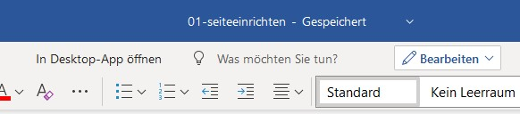
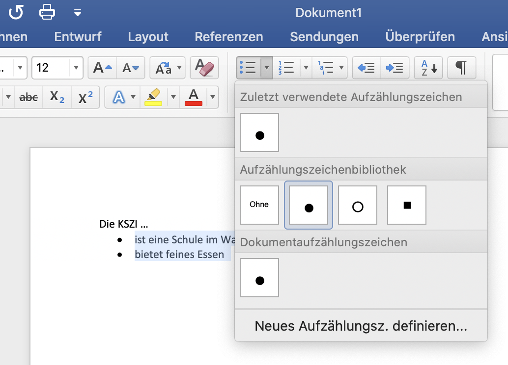

# 02\_A Word

## 🎯 Lernziele

Ziel dieses Kurses ist es, ein Umfangreiches Dokument mit Bild- und Grafikelementen erstellen und gestalten zu können. Dazu zählen eine korrekte Handhabung von Kopf- und Fusszeilen, Verwendung von Formatvorlagen, Erstellen und Anpassen von Inhalts- und Indexverzeichnissen, Rechtschreibprüfung und Silbentrennung anwenden, Druckoptionen kennen und Dateiexporte steuern können.

## Vorbereitung

Melde dich zuallererst bei OneDrive an, indem du das OneDrive-Symbol im Dock anklickst.

## Seite einrichten

### Seitenränder und Layout

* Öffne ein leeres Dokument \(Datei neu\).
* Klicke im Menüband auf das Register Layout und dann auf das Symbol Seitenränder. Wähle Benutzerdefinierte Seitenränder. 

Im ersten Dialogfenster Seitenränder findest du die unten aufgeführten Einstellungen.

* Klicke auf das Register Layout.
* Um bei doppelseitigem Druck rechte bzw. linke Kopf- und Fusszeile zu unterscheiden, klicke auf Gerade/ungerade anders.
* Gestaltest du noch ein Titelblatt, das keine Kopf- und Fusszeile enthalten soll, so klicke auf Erste Seite anders.

### Silbentrennung einstellen

Wenn ein Text im Blocksatz formatiert ist, gibt es oft unschöne Löcher im Absatz, wenn die Silbentrennung nicht aktiv ist. Daher ist es wichtig die Optionen für die Silbentrennung sinnvoll einzustellen.

Gehe zum Register Layout, klicke auf das Symbol Silbentrennung und wähle Silbentrennungsoptionen_. . ._

* Im neuen Fenster lassen sich die Silbentrennoptionen definieren. Die Silbentrennzone ist ein Mass \(in cm\) in dem getrennt werden soll.


**Übung: Layout und Silbentrennung**

Lade die Datei [01\_seiteeinrichten.docx](https://kszich-my.sharepoint.com/:w:/g/personal/urs_bamert_kszi_ch/EWCv777eJn5Bh-xxpgvI8jwBlh-C_8viMN6Vxn1-CyJxFQ?e=dKNAfI). Du kannst die Datei direkt im Browser bearbeiten oder lokal auf dem Computer \(In Desktop-App öffnen\).

Formatiere sie wie folgt:

1. Papierformat auf A4-Hoch einstellen.
2. Stelle die Seitenränder wie folgt ein: Oben: 5 cm, Unten: 2 cm, Links: 3.5 cm und Rechts: 1.5 cm
3. Stelle die Silbentrennung für das ganze Dokument auf ’automatisch’ und wähle 3 aufeinander folgende Trennstriche. Die Silbentrennzone ist ein Mass \(in cm\) in dem getrennt werden soll.


## Dokument speichern/schützen

### Speichern, wiederfinden und öffnen

Fange gleich zu Beginn der Arbeit mit dem Speichern des Dokuments an.

* Wähle hierzu Datei --&gt; Speichern unter
* Beachte dabei, dass

  * der Dateiname aussagekräftig ist.
  * das Dateiformat richtig gewählt ist.
  * der Speicherort bewusst gewählt ist \(lokal auf einer Festplatte oder in der Cloud? Was sind Vor- und Nachteile?\).

### Die wichtigsten Word-Formate

* .docx: Dieses Format kann nur von Word 2008 und Word 2011 für Mac und Word 2007 und Word 2010/2013 geöffnet und weiterverarbeitet werden.
* .doc: Dieses Format ist kompatibel zu älteren Word-Versionen.
* .dotx: Wenn du eine Datei als Vorlage abspei- chern willst, verwende dieses Format.
* .rtf: Das Rich-Text-Format \(rtf\) ist ein sehr gutes Austauschformat von Text- und Bild- informationen mit anderen Nicht- Microsoft-Programmen.
* .pdf: Dieses Format speichert die Word-Datei als pdf-Datei ab. Damit kannst du anderen Personen dein Dokument mit Nur-Lese-Zugriff zur Verfügung stellen. Dein Dokument kann dann mit dem Adobe Reader betrachtet werden.


Denke immer daran, dass du keine Dateien auf den Schulcomputern speichern kannst! Benutze in diesem Fall unbedingt die Intranet-Cloud oder OneDrive.


## Word-Einstellungen

1. Öffne ein neues leeres Dokument.
2. Wähle "Word" und dann "Einstellungen". Hier stehen dir verschiedene Einstellungen zur Verfügung, um Word anzupassen. 5 wichtige Einstellungen schauen wir uns genauer an: 

**Allgemein**

Hier kannst du z.B. deinen Benutzernamen oder das Office-Design wählen.

**Speichern**

Stelle hier die AutoWiederherstellung so ein, dass Word alle 10 Minuten deine Ar- beit automatisch speichert.

**Menüband Anpassen**

Hier kannst du einstellen, welche Optionen du im Menüband von Word angezeigt haben möchtest.

**Sprache**

Stelle sicher, dass unter Bearbeitungssprachen auswählen die Sprache Deutsch \(Schweiz\) aufgeführt ist; so wird das ß korrigiert.

## Zeichenformatierung

Im Register Start stehen diverse Formatierungsoptionen zur Verfügung. Mit nachfolgender Übung lernst du die Optionen besser kennen.


**Übung: Zeichenformatierung I**

Bei Teams findest du die Datei [02\_formatieren.docx](https://kszich-my.sharepoint.com/:w:/g/personal/urs_bamert_kszi_ch/EVqaDRZhQiVIpEa9ToZdfH4B2GNvZtk7qK_Err2reXA0TQ?e=RPahcG). Lade die Datei herunter und formatiere sie wie in der Datei angegeben.


### Festlegen von Standardformatierungen

Word verwendet standardmässig als Schriftart ’Calibri’. Wem diese Schrift nicht gefällt oder die Schriftgrösse für jedes neue Dokument anders haben möchte, kann dies permanent fixie- ren.

Gehe hierzu auf dem Register Start zur Gruppe Schriftart. Rechtsklicke die Standardformatvorlage um Änderungen vorzunehmen.

Hier kannst Du die Standardschriftart von Calibri \(Textkörper\) in deine gewünschte Schriftart ändern.

## Absatzformatierung

Im Register Start stehen mehrere Absatzformatierungsoptionen zur Verfügung.

### Weitere Einstellungen für den Absatz

Öffnen ein neues leeres Dokument und öffne das Menü "Absatz" - mit der Suchfunktion der Hilfe ist das Menü leicht zu finden.

**Einzug**

Hier stellst du die Einzüge für den ausgewählten Absatz ein. Unter Extra kannst du den hängenden Absatz einrichten, dabei wird erst die zweite Zeile eingezogen.

**Abstand**

Hier definierst du den Abstand vor und nach einem Absatz. Den Zeilenabstand kannst du auch hier einstellen. In der Regel ist Einfach eingestellt.

**Vorschau**

In diesem Fenster siehst du deine definierten Einstellungen. Mit OK übernimmst du die Einstellungen.


**Übung: Absatzformatierung**

Lade die Datei [03\_absatzformate.doc](https://kszich-my.sharepoint.com/:w:/g/personal/urs_bamert_kszi_ch/Ea6X5yn6zAZDkq8lsK6zQcIBbSF9Mx042k5ZBhaxA-_gDg?e=tpjdnw). Formatiere die Absätze gemäss Vorlage bzw. Text.


## Formatvorlagen

Die Formatvorlagen finden sich im Register Start.

### Formatvorlagen zuweisen

Formatvorlagen bieten den Vorteil, dass Änderungen an der Formatierung eines Textes im Dokument mit einem Befehl vorgenommen werden können. Dazu musst du aber zuerst dem Text die verschiedenen Formatvorlagen zuweisen. Word bietet dir eine Auswahl an verschie- denen Formatvorlagen.

1. Öffne ein neues leeres Dokument.
2. Schreibe auf der ersten Zeile: «Titel» und gehe durch drücken der Enter-Taste auf eine neue Zeile.
3. Füge mit der folgenden Funktion 3 Absätze mit je 8 Sätzen ein: =rand\(3,8\) \(schreibe die Funktion und betätige anschliessend mit der Enter-Taste\)
4. Markiere den Text \(Titel, Absatz, …\) und wähle im Register Start in der Gruppe Format- vorlagen eine Vorlage aus \(Überschrift 1 für Titel\). Weise nun dem ganzen Dokument \(passende\) Formatvorlagen zu.

### Formatvorlagen anpassen

Um Formatvorlagen anzupassen gehe wie folgt vor:

* Klicke mit der rechten Maustaste in der Gruppe Formatvorlagen auf das Symbol der Formatvorlage \(z.B. Standard\).
* Wähle Ändern_. . ._ aus.

* Passe im neuen Dialogfenster die gewünschten bzw. geforderten Eigenschaften an.


**Übung: Formatvorlagen zuweisen und anpassen**

Lade die Datei [04\_formatvorlage.docx](https://kszich-my.sharepoint.com/:w:/g/personal/urs_bamert_kszi_ch/EXH8Y0V3sPZOuB4KzgZFQZsBuV2Y4_G6rrLaRXETVP8FPg?e=sZijiM) herunter und öffne sie.

1. Passe die Formatvorlage Überschrift 1 wie folgt an:
   1. Schriftgrösse: 36 pt
   2. Absatzformat: Ausrichtung: rechtsbündig, Abstand nach: 48 pt


## Nummerierungs- und Aufzählungszeichen

### Aufzählungszeichen einfügen

Nummerierungs- und Aufzählungszeichen strukturieren einen Text oder machen eine stich- wortartige Aufzählung übersichtlicher. Solche Elemente bezeichnet man auch als Listen. Lis- ten werden linksbündig dargestellt.


**Übung: Aufzählungszeichen einfügen**  
  
Lade die Datei [05\_aufzaehlungen.docx](https://kszich-my.sharepoint.com/:w:/g/personal/urs_bamert_kszi_ch/EaAj7-TWCxtCgMCp-yvesO0B5E7zguJa35UwLfofhxeysw?e=IslJgE) herunter und öffne sie.

1. Wähle den Text aus, den du mit Aufzählungszeichen darstellen willst.
2. Klicke im Register Start in der Gruppe Absatz auf das Aufzählungs-Symbol. Nun erhält dein markierter Absatz Punkte.
3. Um das Aufzählungszeichen zu ändern, klicke auf den Pfeil im Aufzählungs-Symbol, jetzt erscheint die Aufzählungszeichenbibliothek.
4. Wähle nun das gewünschte Zeichen.
5. Was, wenn du weitere Aufzählungszeichen suchst? Dann wähle Neues Aufzählungszeichen definieren_. . ._ Hier kannst du auch die Farbe des Zeichens ändern.
6. Klicke auf Schriftart und wähle dort bei Schriftfarbe eine Farbe aus.


### Nummerierung mit mehreren Ebenen einfügen

Mit Nummerierungen kann eine Aufzählung gegliedert werden. Häufig kommt die Gliederung bei Überschriften einer Dokumentation vor.

Die Nummerierung wird ähnlich wie bei der Aufzählung einer Auswahl hinzugefügt. Bei der Nummerierung kann zwischen nummerierten Listen und Listen mit mehreren Ebenen ausge- wählte werden.


**Übung: Nummerierung mit mehreren Ebenen**  
  
Lade die [Datei 06\_nummerierung.docx](https://kszich-my.sharepoint.com/:w:/g/personal/urs_bamert_kszi_ch/EU05Gygq9Z1NmhbruonYE6kB0X0keqAFleQp-8yFViRdeQ?e=GQKQCZ) herunter und öffne sie.

1. Wähle den Absatz aus, der mit einer Liste mit mehreren Ebenen formatiert werden soll.
2. Klicke auf das Liste mit mehreren Ebenen-Symbol und wähle die gewünschte Liste aus.
3. Um eine Nummerierung eine Stufe tiefer zu stufen, setze den Cursor vor den Text und drücke die Tabualtor-Taste.


## Kopf- und Fusszeile einfügen

1. Öffne ein neues leeres Dokument
2. Wähle im Register Einfügen im Menü Kopf- und Fusszeile ob du eine Kopf- oder Fuss- zeile einfügen möchtest.
3. Durch Anklicken von Kopf- respektive Fusszeile erscheint eine Auswahl an verschiede- nen Darstellungen der Kopf- respektive Fusszeilen.
4. Im Register Kopf- und Fusszeile lassen sich variable Elemente wie die Seitenzahlen, das Datum und die Uhrzeit einfügen. Über die Symbole Kopfzeile bzw. Fusszeile lassen sich Vorlagen einfügen.


**Übung: Kopf- und Fusszeilen**

Lade die Datei [07\_kopfundfuss.docx](https://kszich-my.sharepoint.com/:w:/g/personal/urs_bamert_kszi_ch/EbSnjKL2QcNFr1g-Ih9w750BAPgXYDY7L3WzgKxP1hrLyw?e=vI2ivo) herunter und öffne sie.

1. Erstelle eine Kopfzeile wie folgt:

   1. linksbündig: Word 16.39
   2. zentriert: Dein Name
   3. rechtsbündig: aktuelles Datum
   4. Rahmen unten

  

2. Erstelle eine Fusszeile wie folgt:
   1. linksbündig: KZI
   2. rechstsbündig: Seiten-Nr.


### Kopfzeile mit Feldfunktion \(Kapitelüberschrift\)

Bei umfangreichen Dokumentationen ist es übersichtlicher, wenn auf jeder Seite das Kapitel in der Kopfzeile erscheint. Dies kannst du mit einer Feldfunktion einfügen.


**Übung: Kopf- und Fusszeilen**

Lade die Datei [08\_kopfkapitel.docx](https://kszich-my.sharepoint.com/:w:/g/personal/urs_bamert_kszi_ch/EYrtLvB4G4dOvmeNpNl8wb0BvmXJGwdFfo-NuLzDMwdSSw?e=ev8fGA) herunter und öffne sie.

1. Weise dem ganzen Dokument für die Titel Formatvorlagen zu. Wähle für die oberste Titelhierarchie Überschrift 1. Für die Feldfunktion muss die Formatvorlage für die Titel festgelegt sein.
2. Öffne die Kopfzeile indem du doppelt in den Kopfbereich des Dokuments klickst.
3. Klicke nun in der Kopfzeile an die Stelle, an welcher die Kapitelüberschrift stehen soll.
4. Wähle im Reiter Einfügen das Menü Text und dort "Feld".
5. In der Kategorie-Liste klicke auf Verknüpfungen und Verweise \(ganz unten\) und wähle dann rechts Feldname StyleRef \(ganz unten\).
6. Wähle unter "Optionen" "Formatvorlagen" und dort "Überschrift 1" und klicke auf "hinzufügen", danach auf "ok". Jetzt wird in der Kopfzeile die Überschrift angezeigt.


## Tabellen einfügen

* Öffne ein neues leeres Dokument.
* Bestimme die Anzahl Zeilen und Spalten der Tabelle im Beispiel unten. Diese Tabelle wirst du im nächsten Schritt gleich selbst erstellen.

* Wähle im Register Einfügen in der Gruppe Tabellen Tabelle einfügen.
* Hinterlege im Dialogfenster die zuvor bestimmte Anzahl Spalten und Zeilen. Drücke dann OK.

* Gestalte die Tabelle nach Vorlage. Wähle hierzu die Tabelle an \(Kreuz in der linken oberen Ecke anwählen\) und gehe zur Gruppe _Tabellenentwurf_. Die Kästchen der zweiten und dritten Spalte findest du im Register Einfügen --&gt; Gruppe Symbol --&gt; Weitere Symbole.

Vorlage:


**Übung: Text \(mit Tabulatoren\) in Tabelle konvertieren**

Lade die Datei [09\_tabelle.docx](https://kszich-my.sharepoint.com/:w:/g/personal/urs_bamert_kszi_ch/EaVKYmbkrkxNol10lkeyLUUB8A3PVmh6EfB1T0NuXY-xsg?e=F0pMtU) herunter und öffne sie.

1. Die Datei enthält eine Liste mit Tabulatoren. Diese Liste wandeln wir in ein Tabelle um.
2. Markiere die Liste und klicke im Register Einfügen in der Gruppe Tabellen auf Tabelle und wähle dann Text in Tabelle konvertieren_. . ._
3. Klicke im Dialogfeld unter Text trennen bei auf die Option Tabstopps
4. Klicke auf OK.


## Bilder einfügen und formatieren


**Übung: Bilder einfügen und formatieren**

Lade die Datei [10\_grafik.docx](https://kszich-my.sharepoint.com/:w:/g/personal/urs_bamert_kszi_ch/EbjNZBX0-oNMsZHwpl7qXTUBsNGNYQx7rBdM27EDIIKl9Q?e=GOdrdr) herunter und öffne sie.

1. Wähle im Register Einfügen "Bilder".
2. Wähle die Bild-Datei aus und füge diese mit Einfügen in dein Word- Dokument ein.
3. Klicke nun auf das eingefügte Bild und wähle im Menüband den Register Format. Hier findest du alle wichtigen Einstellungen zu deinem Bild.
4. Skaliere das eingefügte Bild in der Gruppe Grösse so, dass es eine Höhe von 10 cm aufweist. Die Breite wird automatisch angepasst.
5. Um das Bild im Text zu positionieren, wähle in der Gruppe Anordnen das Sym- bol Position. Wähle eine Position für dein Bild aus. Beim Symbol Zeilenumbruch kannst du weitere Einstellungen zur Position des Bildes bestimmen.
6. Damit Bild und Text sich nicht gegenseitig beeinflussen, kannst du in der Gruppe Anordnen das Symbol Textumbruch wählen. Wähle Hinter den Text , so dass der Text über das Bild geschrieben wird.


## Fussnoten und Inhaltsverzeichnis

### Fussnoten einfügen

Eine Fussnote ist eine Anmerkung in Form einer Hochzahl \(1\) zu einer Textstelle, einem Zitat oder einem Wort im Text. Die Fussnote wird am unteren Rand der Seite eingefügt und fort- laufend nummeriert. Die Anmerkungen können auch am Schluss des Dokuments aufgeführt werden. Dann heissen die Anmerkungen Endnoten. In Word können sowohl Fussnoten wie auch Endnoten eingefügt werden.


**Übung: Fussnoten einfügen**

Lade die Datei [11\_fussnote.docx](https://kszich-my.sharepoint.com/:w:/g/personal/michael_liebich_kszi_ch/EfediOX7dQhDgm_VlWHdmDEBiCTgwXIyeRp0B9qZojsDaQ?e=gmLq9W) herunter und öffne sie.

1. Setze den Cursor an die Stelle \(Wort- oder Satzende\) wo das Fussnotenzeichenerscheinen soll.
2. Wähle im Register Einfügen --&gt; Fussnote...

Weitere Einstellungen bezüglich Fuss- und Endnote kannst du machen, indem du in der Gruppe Fussnoten auf das Symbol in der unteren rechten Ecke klickst. Im erscheinenden Dialogfenster kannst du z.B. auswählen wo die Fussnoten erscheinen oder wie sie nummeriert werden sollen.


### Inhaltsverzeichnis einfügen

Das Inhaltsverzeichnis platzieren wir an den Textanfang, also auf der ersten Seite. Zunächst musst du im Dokument mindestens die Formatvorlage Überschrift 1 auf alle Titel anwenden. Je mehr Formatvorlagen \(Überschrift 1, Überschrift 2, usw.\) angewendet sind, um so umfangreicher kann das Inhaltsverzeichnis dargestellt werden.


**Übung: Inhaltsverzeichnis einfügen**

Lade die Datei [12\_inhalt.docx](https://kszich-my.sharepoint.com/:w:/g/personal/michael_liebich_kszi_ch/EabEMtHshiNLoFIIoyp3zPQBUNIyp0z9mZx0JmrBfxvWzA?e=0p03AA) herunter und öffne sie.

1. Weise den Titeln \(Inhalt, Einleitung, _. . ._\) die Formatvorlage Überschrift 1 zu.
2. Klicke dann im Register Referenzen auf Inhaltsverzeichnis.
3. Wähle unten Benutzerdefiniertes Inhaltsverzeichnis.
4. Wähle im Dialogfenster Inhaltsverzeichnis unter Allgemein --&gt; Formate ein passendes Format aus.
5. Unter Ebenen anzeigen kannst du einstellen, wie viele Ebenen \(Überschrift 1, 2, …\) angezeigt werden sollen.


## Zitate und Literaturverzeichnis

Bevor wir ein Zitat oder eine Literaturliste hinzufügen können, müssen wir die Quellen \(Bü- cher, Fachartikel, usw.\) erfassen. Die Quellen werden im aktuellen Dokument gespeichert und können mit dem Quellen-Manager verwaltet werden, das heisst auf andere Dokumente über- tragen werden.


**Übung: Zitate und Literaturverzeichnis**  
  
Lade die Datei [13\_quellen.docx](https://kszich-my.sharepoint.com/:w:/g/personal/michael_liebich_kszi_ch/EQDwuNMcAbtMuDf2Hd8zAOcBZ4KbRM3bPMMKtyZ037VsBw?e=65OpEP) herunter und öffne sie.   
In dieser Datei sind 5 Zitate geschrieben. Wir erfassen nun die dazugehörigen Quellen.

1. Gehe im Register Referenzen zum Symbol mit den beiden Büchern und füge zwei Zitate hinzu: Autor: Yvonne Hofstettler; Titel: Sie wissen alles; Ort: München; Verlag: C. Bertelsmann; Jahr: 2014 Autor: Carsten Görig; Titel: Gemeinsam einsam; Ort: Zürich; Verlag: Orell Füssli; Jahr: 2011
2. Setze in deinem Text diese beiden Quellen an beliebigen Stellen. Gehe dazu im Register Referenzen auf Zitat einfügen.
3. Nach dem Einfügen der Quellen kannst du diese im Text anklicken und, falls nötig, bearbeiten.
4. Am Ende des Dokument kannst du ein Literaturverzeichnis erstellen, indem du im Register Referenzen auf Literaturverzeichnis klickst. Wähle das gewünschte Format aus.


