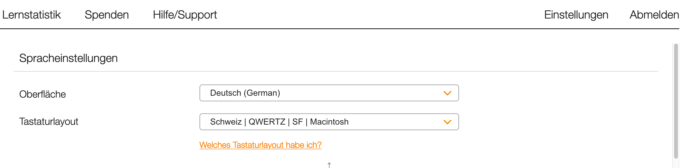

# Tipp 10

### Registrierung

Damit du Tipp10 verwenden kannst, musst du dich erst registrieren.


Nach der Registrierung erhältst du per Mail einen Aktivierungslink. Eventuell landet diese Aktivierungs-Mail im Spam-Ordner.  
KSZI-Mail: [https://tcs.tam.ch](https://tcs.tam.ch)


### Umstellen des Tastaturlayouts auf Schweiz \| QWERTZ \| SF \| Macintosh



